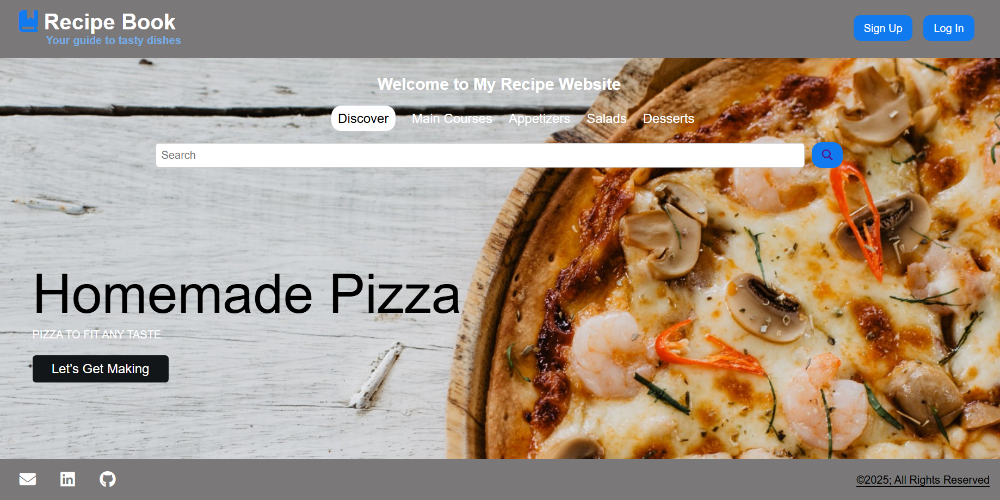

# Recipe App

[Live Demo](https://recipe-book-recepdemir.netlify.app/)

A simple and responsive web-based Recipe App. Users can search for recipes, view details, and interact with buttons such as Like, Save, and Share.

## Features

* Search bar for finding recipes
* Responsive design (mobile-friendly)
* Fixed bottom buttons on recipe page
* Smooth navigation using anchor links
* Clean and modern UI

## Project-folder

├── index.html         
├── register.html     
├── recipe.html
├── style.css           
├── img/               
└── README.md 

## Technologies Used

* HTML5
* CSS3
* Font Awesome (for icons)

## Installation

1. Clone the repository:

   ```bash
   git clone https://github.com/yourusername/recipe-app.git
   ```

2. Open the `index.html` file in your browser.

## Usage

* Use the search bar to find a recipe.
* Click on recipe buttons (Like, Save, Share) fixed at the bottom of the page.
* Sign-up section appears only when you click related buttons. It does not appear when scrolling.

## Screenshots



## License

This project is open source and available under the [MIT License](LICENSE).

---

Feel free to improve this project or use it for learning purposes.
